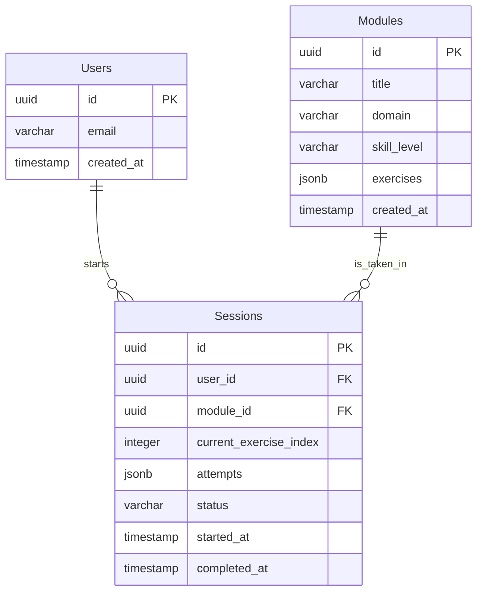

# Overview: Learning Artifacts MVP

An AI-powered learning mode that promotes skill development through interactive, progressive exercises. Users input topics, receive Claude-generated modules, and build real expertise through active practice with AI feedback.

## Problem Statement

When AI agents handle complex tasks autonomously, humans can become passive observers rather than active learners, missing opportunities to develop their own skills and understanding.

## Solution

A dedicated learning mode with interactive, artifact-style learning modules requiring progressive knowledge application. Prioritizes understanding over output through active construction, retrieval practice, immediate feedback, and metacognitive reflection.

# Goals

## Success Criteria

**Primary**

- Score improvement on exercises (e.g., aggregate internal_score from sessions).
- Improved self-confidence rating on a topic over several modules

**Anti-Metrics**

- Total time spent
- Modules started (breadth over depth)

## Scope

**In Scope**

- AI-generated modules
- Split-screen artifact presentation
- Lightweight progress visualization
- Text-based interactions
- Basic completion and score tracking

**Out of Scope**

- Learning Mode toggle (we will assume that this is a prerequisite to interact with learning artifacts)
- Personalized learning paths
- Advanced analytics

# User Experience & Interface Design

## Target User Segment

Working professionals with initial experience leveraging AI to complete tasks, but interested in upskilling their own capabilities and understanding.

### Example Personas

**Alex - The Product Manager**

- Career switcher from engineering to product
- Pain: AI helps write docs but doesn't build strategic thinking
- Goal: Develop product strategy and user research skills

**Maya - The Marketing Coordinator**

- Recent grad, 1 year in marketing role
- Pain: Can create content but struggles to develop campaign strategy
- Goal: Build confidence in marketing frameworks and positioning

**Jordan - The Business Analyst**

- Mid-career professional learning consulting skills
- Pain: Relies on AI for analysis frameworks but can't adapt them independently
- Goal: Develop deeper business strategy understanding

## Key Screens

### **Entry Screen**

- Learning Mode toggle (pre-enabled for the purposes of this prototype)
- Topic search + suggested categories (conversation-based)
- Skill level selector (conversation-based)

UI Inspiration: Claude Research mode toggle

### **Split-Screen Learning Interface**

- **Left Panel (40%):**
    - Regular chat UI
    - Exercise description (highlighted visually)
    - Hints (collapsed; progressive disclosure)
- **Right Panel (60%):**
    - Text editor
    - Lightweight progress tracker at the bottom

UI inspiration: Split-screen interaction pattern; Claude Artifacts

### **Feedback States**

- **Correct:** Green checkmark, reinforcing explanation, auto-advance
- **Partially Correct:** Yellow indicator, specific guidance, revision opportunity
- **Incorrect:** Constructive feedback, targeted hints, solution after 3 attempts

### **Completion Screen**

- Celebration animation, concepts mastered summary
- 1-5 self-confidence rating (for lightweight metacognitive reflection)
- Updated progress visualization

### Interaction Patterns

- Active construction (e.g. no passive multiple choice)
- Progressive disclosure (hints on request)
- Immediate, specific feedback

# Learning Module Generation

**Standard Module Flow**

1. **Analysis** (easier) - Identify/extract from provided material
2. **Comparative Evaluation** (medium) - Rank/compare options with justification
3. **Structured Framework** (harder) - Apply framework to new scenario

This gives users a confidence ramp: observe → judge → create.

```json
# Pseudo-code for module generation
def generate_module(topic: str, skill_level: str, exercise_count: int):

    system_prompt = """
    You are an expert instructional designer creating active learning exercises.

    Requirements:
    - Application-first: users learn by doing, not reading
    - Realistic scenarios from the target domain
    - Clear validation criteria (what makes an answer good vs. poor)
    - Progressive difficulty within the module

    Exercise types: analysis tasks, comparative evaluation, structured frameworks
    """

    user_prompt = f"""
    Create a {skill_level} learning module on: {topic}

    Generate {exercise_count} exercises following this structure:

    Exercise 1 (Analysis): Present realistic material, ask user to identify/extract insights
    Exercise 2 (Comparative): Give 3-4 options, ask user to rank and justify
    Exercise 3 (Framework): Provide structure, ask user to apply to scenario

    For each exercise include:
    1. Clear prompt with scenario/context
    2. Any material needed (customer feedback, data, examples)
    3. 3 progressive hints (conceptual → specific → near-solution)
    4. Validation criteria (what makes an answer strong/weak)
    5. Model answer explanation (not just the answer, but WHY)

    Return as JSON matching this schema: [schema]
    """
```

# Technical Architecture

## System Architecture

- **Frontend:** Deployed on Vercel (fast iteration, global CDN for future scaling).
- **Backend:** Deployed on Railway (Postgres + minimal DevOps).
- **Auth:** Supabase JWT-based auth (Bearer tokens).
- **AI Integration:** Claude API for module generation.

```
Frontend (Next.js + TypeScript + Tailwind)
    ↓ REST API
Backend (FastAPI + Python)
    ↓ Postgres
Database (Supabase)
```

## API Endpoints

## Modules API

| Endpoint | Method | Request | Response | Notes |
| --- | --- | --- | --- | --- |
| `/api/modules` | GET | - | `{ modules: [{ id, title, domain, skill_level, exercise_count, estimated_minutes }] }` | List all modules |
| `/api/modules/{id}` | GET | - | `{ id, title, domain, skill_level, exercises: [...], created_at }` | Full module with exercises |
| `/api/modules/generate` | POST | `{ topic, skill_level, exercise_count? }` | `{ module_id, title, domain, skill_level, exercises: [...], estimated_total_minutes }` | Generate new module via Claude |

## Sessions API

| Endpoint | Method | Request | Response | Notes |
| --- | --- | --- | --- | --- |
| `/api/sessions` | POST | `{ module_id }` | `{ session_id, module_id, user_id, current_exercise_index: 0, status: "in_progress", started_at }` | Start new session |
| `/api/sessions/{id}` | GET | - | `{ session_id, module_id, current_exercise_index, attempts: [...], status, started_at, completed_at }` | Get session state |
| `/api/sessions/{id}` | PATCH | `{ current_exercise_index?, status?, confidence_rating? }` | `{ session_id, current_exercise_index, status, confidence_rating, completed_at }` | Update session |
| `/api/sessions/{id}/submit` | POST | `{ answer_text, time_spent_seconds, hints_used }` | `{ assessment, internal_score, feedback, should_advance, attempt_number, hint_available, model_answer_available }` | Submit answer |
| `/api/sessions/{id}/hint` | POST | `{ hint_level? }` | `{ hint_level, hint_text, hints_remaining }` | Request hint |

## Error Responses

| Status Code | Error Type | When |
| --- | --- | --- |
| 401 | Unauthorized | Invalid or expired JWT token |
| 404 | Not Found | Module or session does not exist |
| 429 | Rate Limited | Claude API rate limit exceeded |
| 500 | Server Error | Module generation failed or internal error |

**Error Format:** `{ error, message, retry_after? }`

## Data Models



### Users

| Column | Type | Constraints | Description |
| --- | --- | --- | --- |
| `id` | UUID | PRIMARY KEY | Unique user identifier |
| `email` | VARCHAR(255) | UNIQUE, NOT NULL | User email address |
| `created_at` | TIMESTAMP | DEFAULT NOW(), NOT NULL | Account creation timestamp |

### Modules

| Column | Type | Constraints | Description |
| --- | --- | --- | --- |
| `id` | UUID | PRIMARY KEY | Unique module identifier |
| `title` | VARCHAR(255) | NOT NULL | Module display name |
| `domain` | VARCHAR(100) | NOT NULL | Subject area (e.g., "product_management") |
| `skill_level` | VARCHAR(50) | NOT NULL, CHECK IN ('beginner', 'intermediate', 'advanced') | Target difficulty level |
| `exercises` | JSONB | NOT NULL, DEFAULT '[]' | Array of exercise objects (see schema below) |
| `created_at` | TIMESTAMP | DEFAULT NOW(), NOT NULL | Module creation timestamp |

### Sessions

| Column | Type | Constraints | Description |
| --- | --- | --- | --- |
| `id` | UUID | PRIMARY KEY | Unique session identifier |
| `user_id` | UUID | FOREIGN KEY → users(id), NOT NULL, ON DELETE CASCADE | User taking module |
| `module_id` | UUID | FOREIGN KEY → modules(id), NOT NULL | Module being completed |
| `current_exercise_index` | INTEGER | NOT NULL, DEFAULT 0 | Current position in exercises array |
| `attempts` | JSONB | NOT NULL, DEFAULT '[]' | Array of attempt objects (see schema below) |
| `status` | VARCHAR(50) | NOT NULL, DEFAULT 'in_progress', CHECK IN ('in_progress', 'completed') | Session completion state |
| `confidence_rating` | INTEGER | NULL, CHECK (confidence_rating BETWEEN 1 AND 5) | User’s self-assessed confidence after completing module |
| `started_at` | TIMESTAMP | DEFAULT NOW(), NOT NULL | Session start time |
| `completed_at` | TIMESTAMP | NULL | Session completion time |

## JSONB Schemas

### Modules.exercises Structure

```json
[
  {
    "sequence": 1,
    "type": "analysis",
    "prompt": "Review this customer feedback summary. Identify the top 3 pain points and explain why each matters for product strategy.",
    "material": "Customer feedback text or data goes here...",
    "hints": [
      "Think about what evidence directly supports each pain point",
      "Consider how each issue affects activation or retention",
      "Compare your prioritization - which has biggest business impact?"
    ],
    "validation_criteria": {
      "evidence_based": "Are insights grounded in provided material?",
      "strategic_reasoning": "Do they explain business/product impact?",
      "completeness": "Did they identify 3 pain points with explanations?",
      "clarity": "Is response structured and understandable?"
    },
    "model_answer": "1. Setup complexity: Users report confusion during first-run...",
    "model_explanation": "This answer is strong because it identifies evidence-based pain points and connects each to specific business impacts...",
    "estimated_minutes": 8
  },
  {
    "sequence": 2,
    "type": "comparative",
    "prompt": "Rank these 3 marketing headlines from most to least effective for SaaS founders. Explain your reasoning.",
    "options": [
      "AI-powered analytics for smarter decisions",
      "Stop guessing. Start knowing what your customers want.",
      "Enterprise-grade business intelligence made simple"
    ],
    "hints": [
      "Consider what specific pain points SaaS founders have",
      "Think about clarity, specificity, and emotional appeal",
      "Compare how each headline speaks to the target audience"
    ],
    "validation_criteria": {
      "audience_reasoning": "Uses target audience context in justification",
      "evaluation_criteria": "Applies relevant frameworks (clarity, positioning, appeal)",
      "justification_quality": "Explains the 'why' behind rankings",
      "comparative_insight": "Shows understanding of tradeoffs"
    },
    "model_answer": "Ranking: B > C > A. Headline B is most effective because...",
    "model_explanation": "This ranking is strong because it demonstrates audience awareness...",
    "estimated_minutes": 7
  },
  {
    "sequence": 3,
    "type": "framework",
    "prompt": "Use the RICE prioritization framework to score this feature request.",
    "material": "Feature description: Users have requested the ability to export reports as PDF...",
    "scaffold": {
      "reach": "What % of users will this impact?",
      "impact": "How much will this improve their experience? (0.25=minimal, 3=massive)",
      "confidence": "How confident are you in your estimates? (0-100%)",
      "effort": "How many person-months will this take?"
    },
    "hints": [
      "For Reach, think about how many users actually export reports regularly",
      "Impact should consider whether this is nice-to-have or blocks a critical workflow",
      "Confidence reflects how much data you have vs. assumptions you're making"
    ],
    "validation_criteria": {
      "framework_application": "Correctly fills all RICE elements",
      "scenario_fit": "Judgments appropriate for the specific feature context",
      "justification": "Explains reasoning for each estimate",
      "completeness": "All required fields completed with thought"
    },
    "model_answer": "Reach: 40% (many users view reports but only subset exports)...",
    "model_explanation": "This application is strong because estimates are grounded in the scenario...",
    "estimated_minutes": 10
  }
]

```

**Field Rules:**

- `type` values: `"analysis"`, `"comparative"`, or `"framework"`
- `material`: present for `analysis` and `framework` types only
- `options`: present for `comparative` type only (array of strings)
- `scaffold`: present for `framework` type only (object with field prompts)
- `hints`: always array of exactly 3 strings (conceptual → specific → near-solution)

### Sessions.attempts Structure

```json
[
  {
    "exercise_index": 0,
    "attempt_number": 1,
    "answer_text": "User's full answer text goes here...",
    "time_spent_seconds": 180,
    "hints_used": 1,
    "assessment": "developing",
    "internal_score": 65,
    "feedback": "You've identified some valid pain points, but let's strengthen the strategic reasoning. What you did well: Correctly pulled issues from the feedback. Where to improve: Your explanations restate the problem rather than analyze impact. Consider how 'can't find team invite' affects activation or retention.",
    "should_advance": false,
    "created_at": "2025-11-09T10:30:00Z"
  },
  {
    "exercise_index": 0,
    "attempt_number": 2,
    "answer_text": "User's revised answer...",
    "time_spent_seconds": 240,
    "hints_used": 2,
    "assessment": "strong",
    "internal_score": 88,
    "feedback": "Excellent work! You identified evidence-based pain points and connected each to specific business impacts. Your point about setup complexity affecting activation is spot-on. This demonstrates solid understanding of how user feedback translates to strategic priorities.",
    "should_advance": true,
    "created_at": "2025-11-09T10:35:00Z"
  }
]

```

**Field Rules:**

- `assessment` values: `"strong"`, `"developing"`, or `"needs_support"`
- `internal_score`: 0-100 (never shown to user, only for analytics)
- `feedback`: single text string (frontend formats with line breaks)
- `hints_used`: 0-3 (number of hints used for this specific attempt)

## Authentication Flow

**Frontend → Supabase:**

- User signs in via Supabase Auth (email/password, OAuth, etc.)
- Frontend receives JWT token from Supabase
- Frontend includes token in Authorization header: `Bearer <token>`

**Backend (FastAPI):**

- Verify JWT using Supabase public key
- Extract `user_id` from token claims
- Use `user_id` for all database operations

## Non-Functional Requirements

- **Responsiveness**
    - Real-time (or perceived real-time) chat responses via streaming.
    - Feedback on module submissions returned within 1–2 seconds to maintain UX flow.
    - Module generation occurs within < 15 seconds.
- **Scalability**
    - Support concurrent module generations across multiple users.
    - Claude rate limits are handled gracefully.
- **Reliability**
    - Error handling with retry logic.
    - Fallback messages for module generation failure.
- **Data Integrity**
    - FK relationships enforce referential integrity.
- **Security**
    - All API requests authenticated via JWT verification (Supabase Auth).
